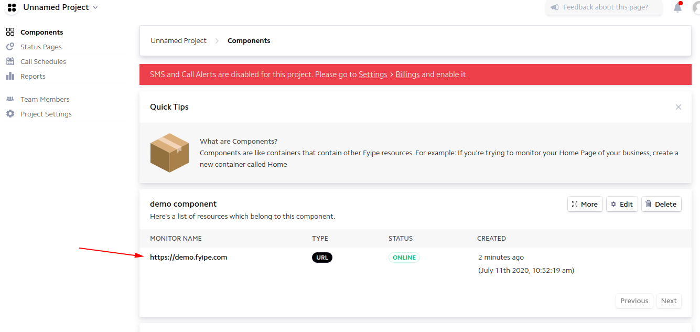
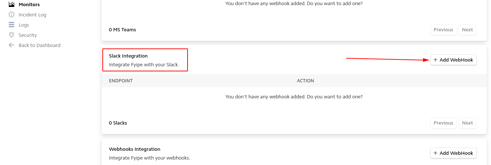
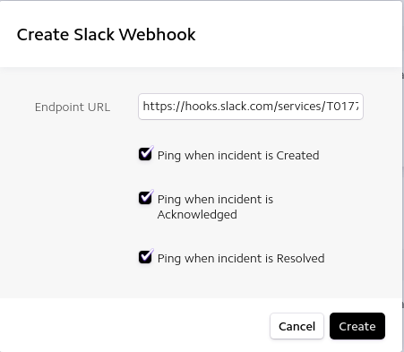
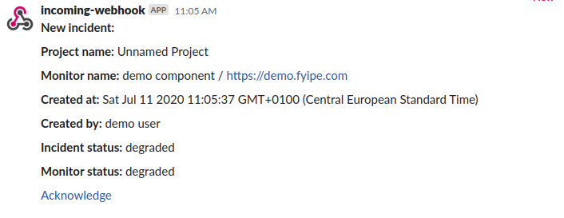

Fyipe can be configured to send notifications related to incidents into Slack and Microsoft Teams channels.
# Slack
## Create incoming hooks
The first step is to configure an incoming webhook in the channels that you want to be used by Fyipe. If you didn't do it that before, you can follow the first three steps in this [tutorial](https://api.slack.com/messaging/webhooks#getting_started). Save the Webhook url from the third step as you'll need it to configure fyipe.
## Configure Fyipe
Once the incoming hooks is configure, go to the dashboard and select the monitor that you want to target from the component.

Scroll down to the Slack integration section and click on add webhook.

Paste the webhook url, and check the event that you want to be notified about. 

Now, you should receive notifications on your channel.

